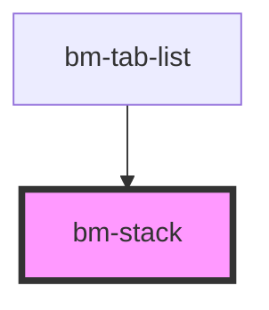

# bm-stack

<!-- Auto Generated Below -->

## Properties

| Property      | Attribute     | Description | Type                                                                       | Default      |
| ------------- | ------------- | ----------- | -------------------------------------------------------------------------- | ------------ |
| `gap`         | `gap`         |             | `"large" \| "none" \| "small"`                                             | `'small'`    |
| `orientation` | `orientation` |             | `"horizontal" \| "horizontal-reverse" \| "vertical" \| "vertical-reverse"` | `'vertical'` |

## Dependencies

### Used by

 - [bm-tab-list](../bm-tab)

### Graph

----------------------------------------------

*Built with [StencilJS](https://stenciljs.com/)*
